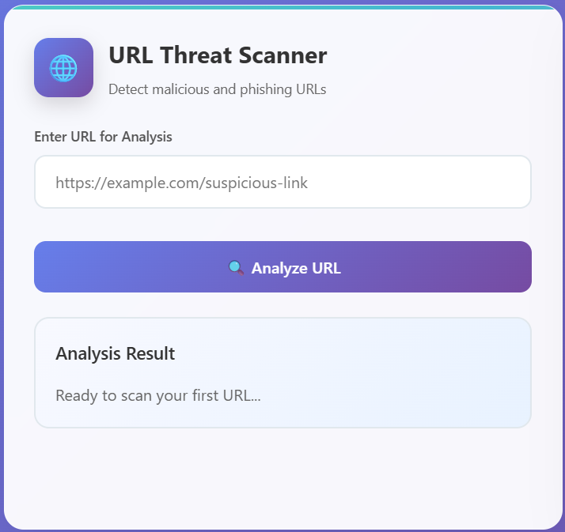
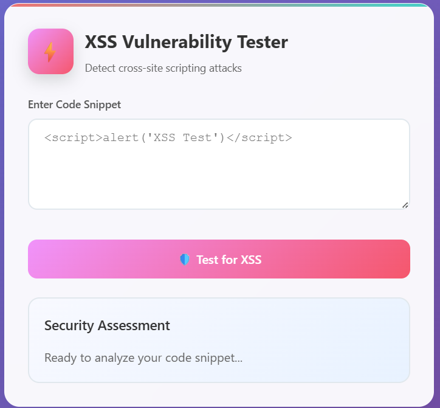

# 🔐 URL Threat Detection Web App

A machine learning-powered web application that detects **Phishing** and **XSS (Cross-Site Scripting)** attacks from URLs. Built using Flask and Scikit-learn, the app provides a clean UI to enter a URL and get real-time threat predictions.

---

## 📌 Features

- ✅ Detects Phishing URLs
- ✅ Detects XSS (Cross-Site Scripting) payloads
- ⚙️ Built with Flask + Scikit-learn
- 📊 Trained on real-world datasets
- 🌐 Web-based interface

---

## 📁 Project Structure

├── app.py # Main Flask backend

├── malicious_url.ipynb # Phishing URL dataset(Kaggle)

├── XSS.ipynb # XSS payload dataset(Kaggle)

├── models/ # Trained ML models

│ └── phishing_model.pkl

│ └── xss_model.pkl

├── static/ # Static assets

│ └── style.css

├── templates/ # HTML templates

│ └── index.html

├── requirements.txt # Python dependencies

└── README.md # Project documentation


---

## 🚀 Getting Started

### 1. Clone the Repository

```bash
git clone https://github.com/Mayankchauhan008/url-threat-detector.git
cd url-threat-detector
```
### 2. Install Dependencies

Install all required Python packages using:
```bash
pip install -r requirements.txt
```
### 3. Run the Application
```bash
python app.py
```

🧠 Datasets

malicious_phish.csv: A labeled dataset for phishing URL detection.

XSS_dataset.csv: A dataset containing XSS attack payloads and benign data.

These are used to train separate ML models.

💾 Trained Models

The models/ directory includes:

phishing_model.pkl: For phishing URL classification

xss_model.pkl: For detecting XSS payloads

Models are typically trained using algorithms like Random Forest or Naive Bayes and saved with joblib or pickle.

## 🖥️ UI Preview

### 🔍 Phishing Detection


### 💥 XSS Detection



### 🔧 Future Improvements

- 🚫 Add SQL Injection detection

- 🔐 Improve model robustness

- 🌍 Integrate with a real-time URL scanner API

- ☁️ Deploy to Heroku, Render, or AWS

- 📦 Add Docker support

---

## 👤 Author

- **Mayank Chauhan & Yash Donga**
- GitHub: [@Mayankchauhan008](https://github.com/Mayankchauhan008)
- GitHub: [@yash-dong025](https://github.com/yash-dong025)


---

## 📝 License

This project is licensed under the **MIT License**.
See the [LICENSE](LICENSE) file for more details.
