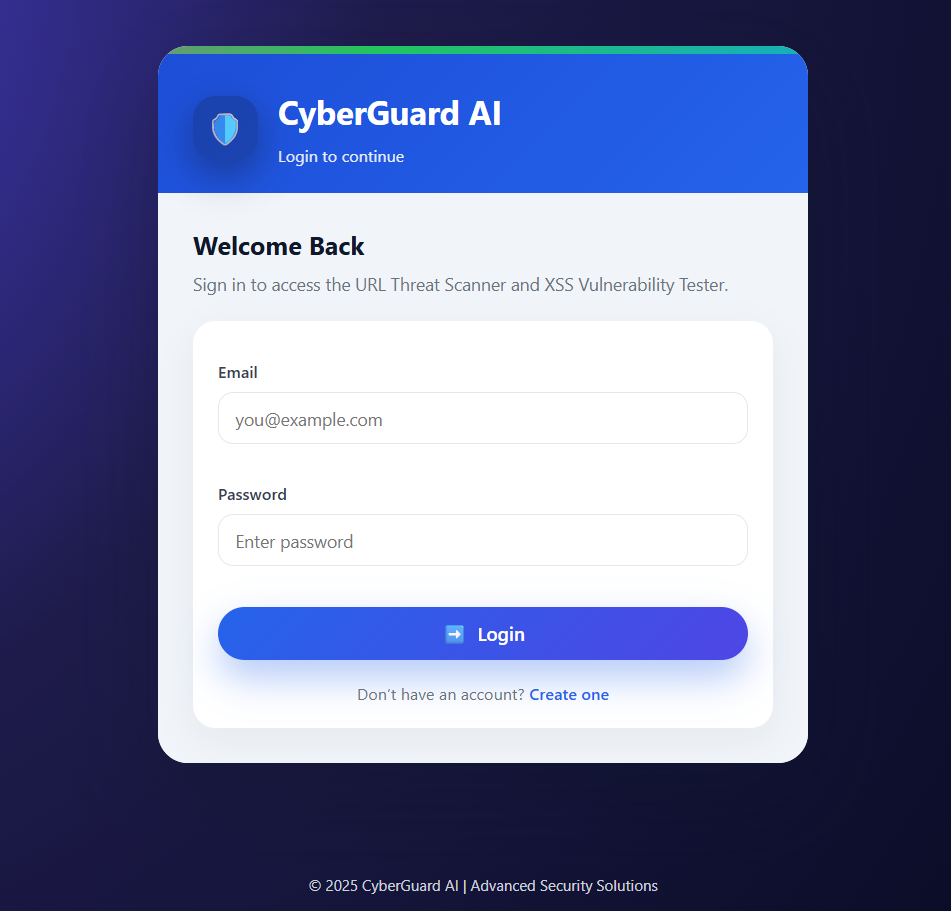
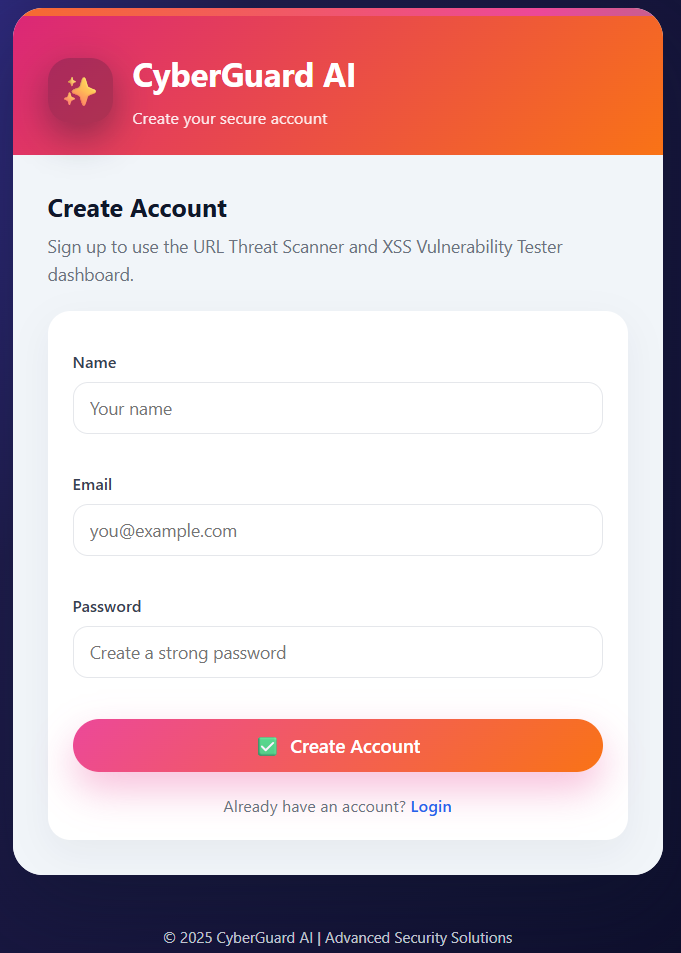

# 🔐 CyberGuard-AI Web App

A powerful cybersecurity web application capable of detecting **Phishing URLs** and **XSS (Cross-Site Scripting)** payloads using Machine Learning.
Now enhanced with a User Authentication System (Login & Register) and a modern UI dashboard.

---

## 📌 Features

🕵️ Phishing URL Detection	 -  ML-based classification of malicious links

⚡ XSS Payload Detection - 	Identifies script injection threats

🔐 Secure Authentication -	Login/Register using SQLite & SHA256 hashing

🎨 React-style Modern UI -	Glassmorphism cards, gradients, animations

📊 Real-world Dataset Trained Models -	Trained on Kaggle datasets

💾 Local data storage - SQLite persistent local database

📡 Real-time predictions -	On-click evaluation output

---

## 📁 Project Structure

├── app.py                     # Main Flask application

├── users.db                   # Authentication database (auto-created)

├── models/                    # ML models & encoders

│   ├── xgboost_gpu_model.pkl

│   ├── random_forest_gpu_model.pkl

│   ├── xss_model.pkl

│   └── xss_vectorizer.pkl

├── templates/                 # Frontend UI pages

│   ├── index.html             # Dashboard

│   ├── login.html             # Login page

│   └── register.html          # Create account page

├── static/

│   └── style.css              # Styling

├── notebooks/                 # Model training notebooks

│   ├── malicious_url.ipynb

│   └── XSS.ipynb

├── requirements.txt           # Dependencies

└── README.md                  # Documentation

---

### 🛠️ Tech Stack

Technology	-  Used For

Python, Flask	 - Backend server

Scikit-learn	- ML model creation

SQLite	-  User authentication DB

HTML / CSS  -	Modern UI

Joblib	-  Model loading

NumPy / Pandas	-  Data preprocessing

---

### 🔑 Authentication Flow

Page	-  Route

Register	-  /register

Login	-  /login

View stored DB users	-  via DB Browser for SQLite

The users.db file stores encrypted passwords (SHA256 hashing).

---

## 🚀 Getting Started

### 1. Clone the Repository

```bash
git clone https://github.com/Mayankchauhan008/CyberGuard-AI.git
cd CyberGuard-AI
```
### 2. Install Dependencies

Install all required Python packages using:
```bash
pip install -r requirements.txt
```
### 3. Run the Application
```bash
python app.py
```
---

🧠 Datasets

malicious_phish.csv: A labeled dataset for phishing URL detection.

XSS_dataset.csv: A dataset containing XSS attack payloads and benign data.

These are used to train separate ML models.

💾 Trained Models

The models/ directory includes:

phishing_model.pkl: For phishing URL classification

xss_model.pkl: For detecting XSS payloads

Models are typically trained using algorithms like Random Forest or Naive Bayes and saved with joblib or pickle.

---

## 🖥️ UI Preview

### 🔐 Login Page


### ✨ Register Page


### 🔍 Phishing Detection


### 💥 XSS Detection


---

### 🔧 Future Improvements

- 🛡 Add SQL Injection & Malware URL detection

- 📡 Add real-time API integration (Google Safe Browsing)

- ☁ Deploy on Render / AWS / Azure

- 🧪 Add unit tests + CI/CD

- 📦 Docker containerization

---

## 👤 Author

- **Mayank Chauhan & Yash Donga**
- GitHub: [@Mayankchauhan008](https://github.com/Mayankchauhan008)
- GitHub: [@yash-dong025](https://github.com/yash-dong025)


---

## 📝 License

This project is licensed under the **MIT License**.
See the [LICENSE](LICENSE) file for more details.
